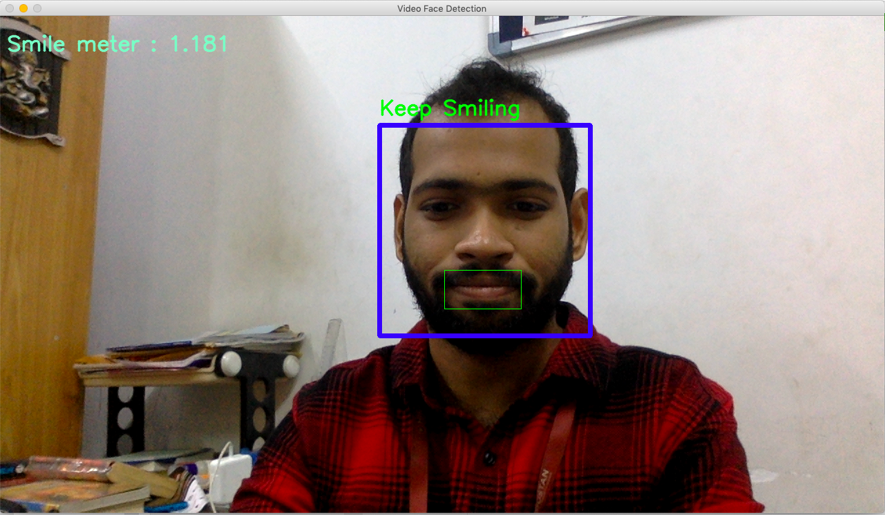

# Happiness_Detector

This Project is a simple smile detection application, which uses the HaarCascade functionality to 
identify whether a person is happy or not .
The project is still in development phase with an average accuracy of 69%.

The pre-requesties for the implemetation for this project are:
- ->python3.2
- ->Using the terminal ---  **pip install opencv-python==3.2.0.7**

- Download the cvcourse for your os and ..

- ->Using the terminal --- **conda env create -f cvcourse_(--your os like windows, macos, linux ..etc).yml**
- ->Using the terminal --- **conda activate** 

Open new terminal window through Python Shell and go to the disk where you installed the cvcourse 
Then load the Github file.
If you are using the Anaconda , then open **JupyterLab** in that respective disk.

** If you are using the External WebCamera make sure that your 
replaced cap = **cv2.VideoCapture(0)** to **cap = cv2.VideoCapture(1)**

